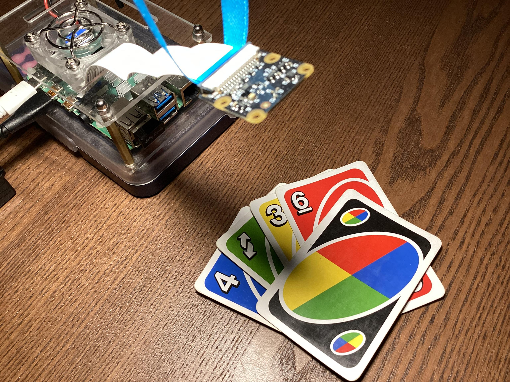

# uno-player

---

## *ENGLISH*

A program that plays the popular Uno card game (final version). Previous development occured at [github.com/alexcoder04/uno-player](https://github.com/alexcoder04/uno-player). The code for training the models can be found there as well.

Latest version on Github: https://github.com/alexcoder04/uno-player-final.

Report bugs [here](https://github.com/alexcoder04/uno-player-final/issues).

### How to use

Clone this repository and run `main.py`. Use the `--help` argument for information about available command-line options.

## Contributors

 - [@nilswgnr](https://github.com/nilswgnr)

---

## *DEUTSCH*

Ein Programm, was das Uno-Kartenspiel spielt (finale Version). Vorherige Entwicklung ist unter [github.com/alexcoder04/uno-player](https://github.com/alexcoder04/uno-player) zu finden. Dort befinden sich auch die Skripte für das Trainieren der Models.

Aktuellste Version auf Github: https://github.com/alexcoder04/uno-player-final.

Bugs und Probleme [hier](https://github.com/alexcoder04/uno-player-final/issues) melden.

### Benutzung

Klone dieses Repository und führe `main.py` aus. Benutze die `--help` Option, um dich über die verfügbaren Kommandozeilen-Argumente zu informieren.

## Mitwirkende

 - [@nilswgnr](https://github.com/nilswgnr)

